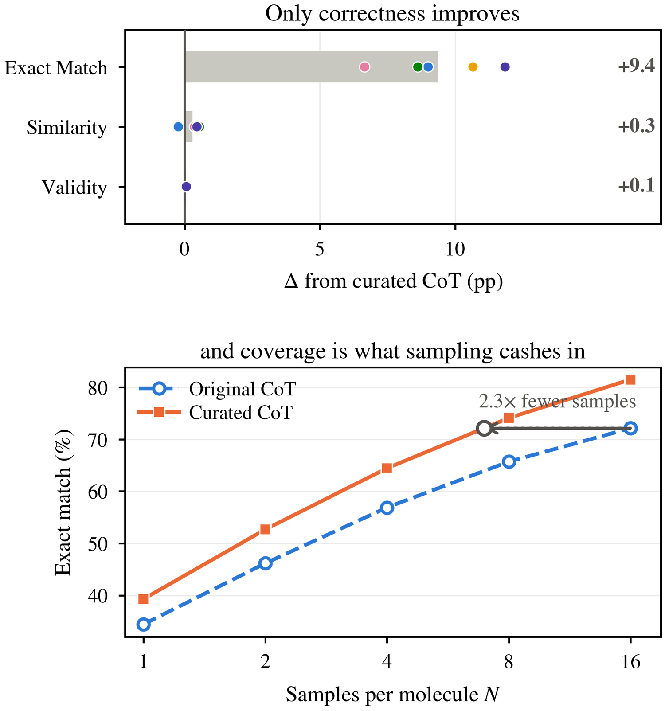
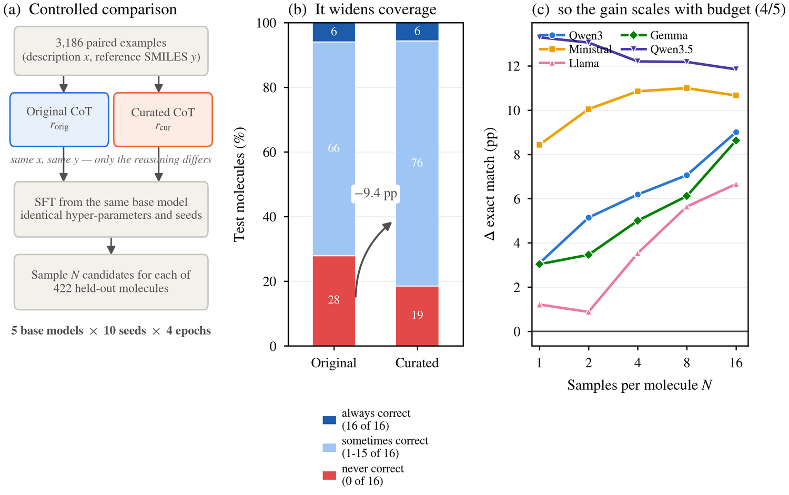
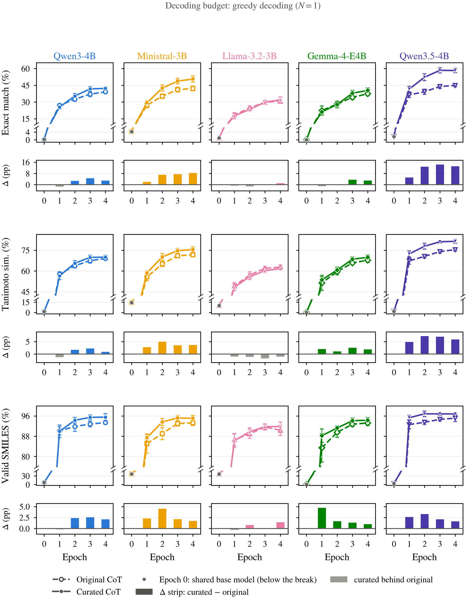
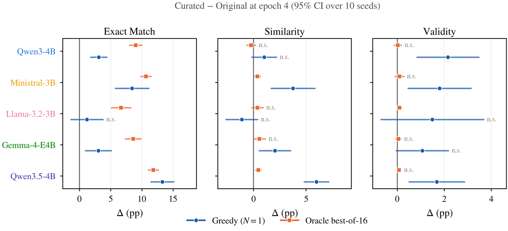
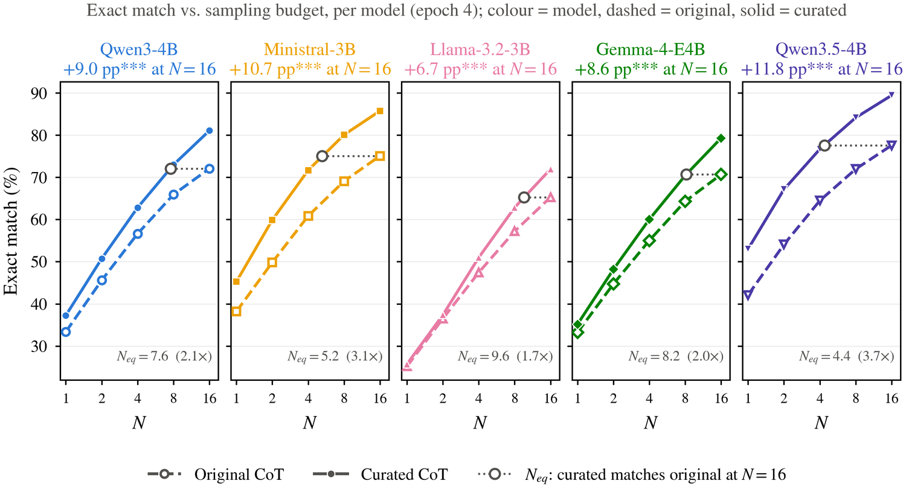
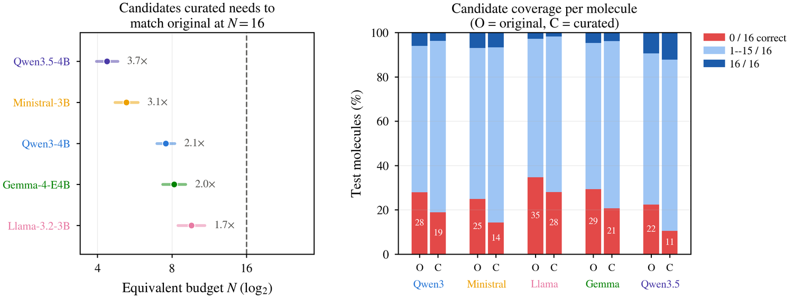

# Curated Chain-of-Thought Buys Coverage, Not Confidence

Anonymous code and data release accompanying our submission on chain-of-thought
curation for molecule generation. Everything needed to reproduce every number,
figure and table in the paper is in this repository.

---

## TL;DR

We fine-tune five base models to generate a molecule's SMILES string from a
natural-language description. Two conditions differ in **one thing only**: the
chain-of-thought used as supervision — the original CoT, or a curated version
of it. Same input/output pairs, same hyper-parameters, same seeds.

Curated CoT does **not** make the model a more fluent chemist. Tanimoto
similarity (+0.3 pp) and SMILES validity (+0.07 pp) barely move; both are near
ceiling. What it changes is **coverage**:

| Of 16 sampled candidates, the molecule is… | Original | Curated | Δ |
|---|---:|---:|---:|
| never correct (0/16) | 27.9% | 18.5% | **−9.4** |
| sometimes correct (1–15/16) | 66.2% | 75.8% | **+9.7** |
| always correct (16/16) | 6.0% | 5.7% | −0.3 |

The always-correct set does not grow. Curation converts molecules the model
could **never** get right into molecules it gets right **sometimes** — and
"sometimes right" is precisely what test-time sampling converts into "right".

So the benefit is invisible in fluency metrics, modest under greedy decoding,
and compounds with the sampling budget: the curated model reaches the baseline's
16-sample accuracy with ~7 samples, a **2.3× reduction** in candidates
(1.7–3.7× per model).

---

## Headline results

Exact match after 4 epochs of SFT, mean over 10 seeds on 422 held-out
molecules. `Δ` is curated − original, paired by seed
(`*` p<0.05, `**` p<0.01, `***` p<0.001, paired *t*-test).

| Model | Greedy orig. | Greedy cur. | Δ | Best-of-16 orig. | Best-of-16 cur. | Δ |
|---|---:|---:|---:|---:|---:|---:|
| Qwen3-4B | 39.1 | **42.2** | +3.1\*\*\* | 72.1 | **81.1** | +9.0\*\*\* |
| Ministral-3B | 42.2 | **50.6** | +8.4\*\*\* | 75.1 | **85.7** | +10.7\*\*\* |
| Llama-3.2-3B | 30.8 | **32.0** | +1.2 (n.s.) | 65.3 | **71.9** | +6.7\*\*\* |
| Gemma-4-E4B | 37.4 | **40.4** | +3.0\*\* | 70.7 | **79.3** | +8.6\*\*\* |
| Qwen3.5-4B | 45.0 | **58.2** | +13.3\*\*\* | 77.6 | **89.4** | +11.8\*\*\* |

Of 75 paired tests at epoch 4, 46 are significant uncorrected and 44 survive
Benjamini–Hochberg FDR control.

---

## Repository layout

```text
.
├── analysis.ipynb                # ALL analysis and figure generation (single entry point)
├── train_sft.py                  # data pairing, SFT, baseline + generation evaluation
├── run_agenticchem.sh            # Slurm array: 5 models x 2 conditions x 10 seeds
├── extract_candidate_stats.py    # per-candidate stats from the prediction files (cached)
├── {train,val,test}_data.jsonl               # original-CoT splits
├── curated_{train,val,test}_data.jsonl       # curated-CoT splits
├── wandb_all_runs_metrics.csv    # exported per-step metric history for all 100 runs
├── candidate_stats_epoch4.csv    # cached per-candidate statistics (see below)
└── new_result/                   # the figures and tables that appear in the paper
```

Running the notebook writes its full output to `results/`, which also contains
supporting analyses beyond the paper. `new_result/` is the released subset:
the six paper figures (vector PDF plus a web-sized PNG) and the three paper
tables.

`runs/` (raw per-molecule predictions, ~1.1 GB) and `wandb/` (local W&B state)
are **not** included. `wandb_all_runs_metrics.csv` and
`candidate_stats_epoch4.csv` are the distilled artifacts everything else is
built from, so the full analysis reproduces without them.

---

## Data

Each line of the JSONL files is an object with three required fields:

```json
{"explain": "A molecule of ethanol.", "smile": "CCO",
 "cot": "Ethanol has a two-carbon chain and a terminal hydroxyl group. <answer>CCO</answer>"}
```

| Field | Role |
|---|---|
| `explain` | the natural-language description given to the model |
| `smile` | reference SMILES; part of the pairing key and the evaluation target |
| `cot` | the SFT supervision text — **this is the only thing that differs between conditions** |

| Split | Records/file | Paired unique keys |
|---|---:|---:|
| train | 3,369 | 2,615 |
| validation | 422 | 336 |
| test | 422 | 332 |

Conditions are paired on the exact `(explain, smile)` string, keeping only keys
present in both files; after pairing, 3,186 training and 400 validation records
have differing CoT text. **Both conditions are always evaluated on the same
`test_data.jsonl`** — `curated_test_data.jsonl` is retained for completeness but
is not used by the training script.

---

## Reproducing

### 1. Environment

Python 3.10. Training needs a single CUDA GPU with BF16 support.

```bash
conda create -n cot-coverage python=3.10 -y && conda activate cot-coverage
# install the PyTorch build matching your CUDA first, then:
pip install transformers trl peft datasets accelerate numpy wandb tqdm rdkit
pip install pandas matplotlib scipy jupyterlab
```

`wandb` is imported at module top level, so it must be installed even when
running with `--no-wandb`.

### 2. Analysis only (no GPU, ~1 minute)

The distilled metrics are committed, so the entire analysis reproduces from a
clean checkout:

```bash
jupyter lab analysis.ipynb     # or: jupyter nbconvert --execute --inplace analysis.ipynb
```

This regenerates every figure and table into `results/`; the
paper subset mirrored here is in `new_result/`.

### 3. Full training (100 runs, GPU)

```bash
mkdir -p slurm_logs
sbatch run_agenticchem.sh --no-wandb          # 5 models x 2 conditions x 10 seeds
```

Or a single pair, without Slurm:

```bash
for variant in original curated; do
  python train_sft.py \
    --model Qwen/Qwen3-4B-Base --experiment-name qwen3-4b-base \
    --variant "$variant" --run-id 0 --seed 1000 --eval-seed 2000 \
    --data-dir . --output-dir ./runs --format-style plain \
    --epochs 4 --max-seq-length 1280 --max-new-tokens 768 \
    --batch-size 4 --eval-batch-size 8 --grad-accum 4 \
    --lr 2e-4 --best-of-n 16 --no-wandb
done
```

Seeds follow `seed = 1000 + run_id`, `eval_seed = 2000 + run_id`. Training uses
LoRA (rank 16, α 32, dropout 0.05) on `all-linear`; `--full-finetune` disables it.

### 4. Rebuild the candidate cache (only if you re-ran training)

```bash
python extract_candidate_stats.py      # reads runs/*/*/run_*/test_predictions_epoch_004.json
```

To log to Weights & Biases, set `WANDB_ENTITY` / `WANDB_PROJECT` or pass
`--wandb-entity` / `--wandb-project`; otherwise use `--no-wandb`.

---

## Results

### Figure 1 — the claim in one figure



*Curating the chain-of-thought buys coverage, not fluency.* **(a)** Change from
curated CoT at a 16-sample budget, averaged over five base models (bar), with
each model shown individually (dots). Exact match gains 9.4 points while
Tanimoto similarity and SMILES validity are unchanged — both are already near
ceiling. **(b)** Exact match against the sampling budget *N*, macro-averaged
over the five models. The curated model reaches the accuracy the original model
attains at *N*=16 using ~7 samples, a 2.3× reduction.

### Figure 2 — design, mechanism, consequence



**(a)** Both conditions fine-tune the same base model on the same 3,186
(description, SMILES) pairs with identical hyper-parameters and seeds; only the
supervising chain-of-thought differs, so epoch 0 is a shared baseline.
**(b)** For every test molecule we count how many of 16 sampled candidates are
exactly correct. Curation shrinks the never-correct bucket by 9.4 points and
that mass lands in the *sometimes*-correct bucket; the always-correct bucket
does not grow. Curation widens the set of reachable molecules rather than
deepening confidence on already-reachable ones. **(c)** Because best-of-*N*
cashes in exactly that reachability, the gain scales with the sampling budget
for four of five models.

### Figure 3 — training trajectories, 3 metrics × 5 models



Greedy decoding. Each panel has a broken y-axis: the epoch-0 base model sits
below the break, the training epochs are expanded above it. The Δ strip under
each panel is curated − original, grey where curated trails. Post-training
itself contributes ~37 points of exact match; the data condition adds a further
5.8 on top. Curation is **not** free early: the curated curve is below original
at epoch 1 for three of five models, crossing over at epoch 2–3.

### Figure 4 — effect at epoch 4, with confidence intervals



Curated − original at epoch 4, 95% CI over 10 seeds. Exact match is where the
effect is both large and reliable; most non-significant cells are similarity
and validity, whose intervals straddle zero.

### Figure 5 — exact match vs. sampling budget, per model



Dashed is original, solid is curated; colour identifies the model. The open grey
marker is *N*<sub>eq</sub>, the budget at which the curated model matches the
original model's *N*=16 score — 4.4 to 9.6 candidates, i.e. 1.7×–3.7× fewer.

### Figure 6 — the mechanism, and its price in inference compute



Left: candidates the curated model needs to match original at *N*=16, with 95%
CI. Right: the per-molecule coverage decomposition that produces it.

### Tables

| | File |
|---|---|
| Table 1 — main results, 3 metrics × 2 budgets, with significance | [`new_result/table1_main_results.tex`](new_result/table1_main_results.tex) |
| Table 2 — gain over the shared epoch-0 base model | [`new_result/table2_gain_over_baseline.tex`](new_result/table2_gain_over_baseline.tex) |
| Table 3 — inference-budget equivalence | [`new_result/table3_budget_equivalence.tex`](new_result/table3_budget_equivalence.tex) |

Every figure-producing notebook cell writes a vector PDF and a PNG preview, and
ends by printing a `FINDING` block whose text is **computed from the data**, so
the stated conclusions cannot drift from the numbers.

---

## What these numbers do and do not mean

We think these caveats matter enough to state up front.

**Best-of-N here is oracle best-of-N.** A molecule counts as solved if *any* of
the N candidates matches the reference, and the winner is picked using the
reference answer. No reranker is trained or implemented. Every best-of-N number,
including the 1.7–3.7× compute saving, is therefore an **upper bound** on what a
deployed system without access to the answer could achieve.

**N ≥ 2 rises partly by construction.** Adding candidates can only turn an
unsolved molecule into a solved one. The informative quantities are the *rate* of
rise and the *gap between conditions*, never the rise itself.

**The reported `best_of_1` column is greedy decoding**, a different decoder from
the sampled candidates used at N ≥ 2. Verified against the raw prediction files,
greedy overstates a single sampled draw by **4.95 pp** on average. Our budget
curves therefore start from sampled pass@1 and show greedy separately.

**Confidence intervals are over 10 seeds on one fixed 422-molecule test set.**
Item-level uncertainty is common to all seeds and does not shrink as seeds are
added; a single-run binomial standard error at EM ≈ 0.65 is already ≈ 2.3 pp.
These intervals describe *these 422 molecules*, not the population of molecules.

**Pairing by seed buys almost no variance reduction.** Cross-model correlation of
the per-seed advantage is ≈ 0 (mean ρ = +0.07). The paired test remains valid,
but the comparison is tight because all runs share one fixed test set, not
because of the pairing.

**Checkpoint selection by minimum validation loss is unreliable here.** It picks
the best test-EM epoch only 2% of the time, and its regret is 2.6 pp *larger*
for the curated condition — so the reported curated numbers are, if anything,
conservative. We therefore report a fixed epoch budget rather than
validation-selected checkpoints. Validation loss is computed against each
condition's *own* CoT and is not comparable across conditions.

**Curation is not free early in training.** Under greedy decoding the curated
model is *below* the original model at epoch 1 for 3 of 5 models; the crossover
happens at epoch 2–3.

**The effect is model-dependent.** Llama-3.2-3B shows no significant greedy gain
(+1.2 pp, p = 0.31), and Qwen3.5-4B's advantage *shrinks* with the sampling
budget (13.3 → 11.8 pp) rather than growing as it does for the other four.

---

## Limitations

- Five base models in the 3–4 B range, one task, one dataset; we do not claim the
  effect transfers to other scales or domains.
- One fixed data split; seeds vary training and sampling, not the split.
- The upstream procedure that produced the curated CoT is described in the paper
  but is not re-runnable from this repository; the curated files are released as
  a fixed snapshot.
- Evaluation uses RDKit canonicalisation with no tautomer, salt or protonation
  normalisation, so chemically equivalent but differently written molecules can
  be scored as mismatches.
- `chat`-format and `plain`-format models differ in loss masking
  (`completion_only_loss`), so cross-model comparisons confound model and format.
  The original/curated contrast is format-matched within each model.

---

## License and citation

Code and data in this repository are released for review. License and citation
information will be added to the camera-ready version.

*This is an anonymized repository prepared for double-blind review. It contains
no author, institution or account identifiers.*
